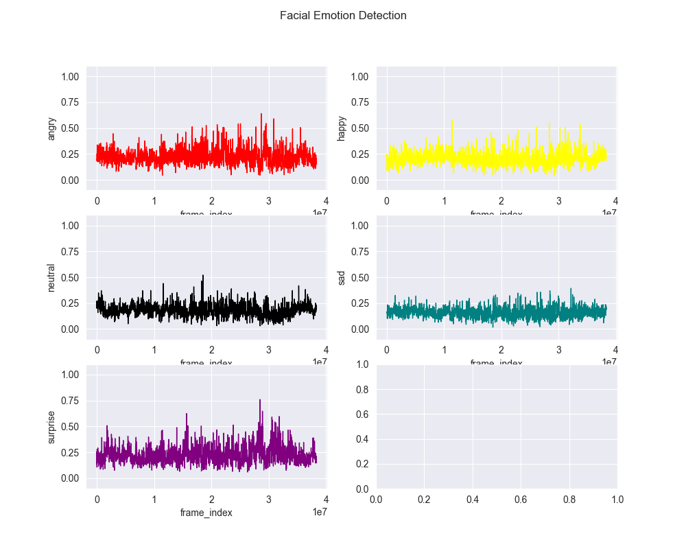
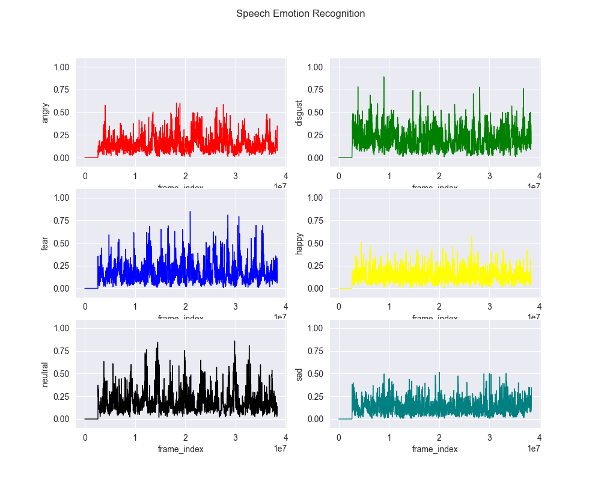

# EmoSense

## About

**EmoSense** represents a cutting-edge advancement in emotion detection technology, combining Automatic Speech Recognition (ASR), Emotion Analysis, Speech Emotion Recognition (SER), and Facial Emotion Detection. This multi-modal system offers a comprehensive approach to understanding human emotions expressed through speech, text, and facial expressions. Through EmoSense, we delve into a new realm of personalized experiences, tailored interventions, and insightful analytics across various domains.

### WIP

Building novel models for each emotion detection task.

## What is EmoSense

Emotions are integral to human communication and interactions, yet accurately detecting and interpreting them presents significant challenges. Existing emotion detection systems often rely on single modalities, such as text or speech, leading to limited accuracy and depth of analysis. Inconsistent or inaccurate emotion detection can hinder personalized user experiences, effective mental health assessments, and interactive technologies.

Problems addressed:

1. Limited accuracy and depth of emotion analysis with single-modal systems.

2. Challenges in understanding emotions expressed through speech, text, and facial expressions.

3. Inconsistent and inaccurate emotion detection hindering personalized experiences and effective assessments.

"EmoSense" is an innovative multi-modal emotion detection system designed to analyze and interpret human emotions through various channels. By integrating **Automatic Speech Recognition (ASR), Text Emotion Analysis, Speech Emotion Recognition (SER), and Facial Emotion Detection**, EmoSense provides a comprehensive understanding of emotional expressions in speech, text, and facial cues. This project aims to revolutionize emotion detection, offering applications in healthcare, education, customer service, and entertainment for tailored experiences and enhanced interactions.

## Models used for each task

1. Automatic Speech Recognition - [Whisper Large v3](https://huggingface.co/openai/whisper-large-v3)

2. Text Emotion Analysis - Fine-tuned [RoBERTa for Sequence Classification](https://huggingface.co/docs/transformers/v4.40.2/en/model_doc/roberta#transformers.RobertaForSequenceClassification)

3. Face Detection - [Fine-tuned YOLOv8](https://huggingface.co/arnabdhar/YOLOv8-Face-Detection)

4. Face Emotion Detection - Fine-tuned [VGG19](https://pytorch.org/vision/master/models/generated/torchvision.models.vgg19.html)

5. Speech Emotion Recognition - Novel SER model as described [here](./models/SpeechEmotionRecog.py)

## Examples

Here are the results of EmoSense for 5 videos sourced from Youtube:

### Input 1 : https://www.youtube.com/watch?v=ERNWm9aiZQw&pp=ygUSbW9ub2xvZ3VlIGNsb3NlIHVw

Graphs: 

Labeled Transcript:
Transcript can be found [here](./outputs/society/labelled_transcript.docx)

Video:
